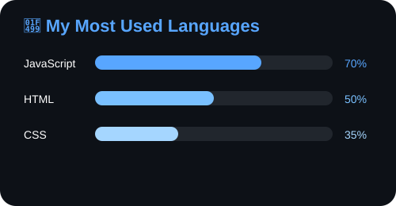

## Hi there I'm Mitzie Petersen!

 Multimediedesign · Web Development · Digital Design 

Welcome to my little corner of GitHub! 

I'm currently studying Multimediedesign and learning more about web development, UX/UI and digital design.

## 💻 Most Used Languages

<!--
**mipe0018/mipe0018** is a ✨ _special_ ✨ repository because its `README.md` (this file) appears on your GitHub profile.

Here are some ideas to get you started:

- 🔭 I’m currently working on ...
- 🌱 I’m currently learning ...
- 👯 I’m looking to collaborate on ...
- 🤔 I’m looking for help with ...
- 💬 Ask me about ...
- 📫 How to reach me: ...
- 😄 Pronouns: ...
- ⚡ Fun fact: ...
-->
